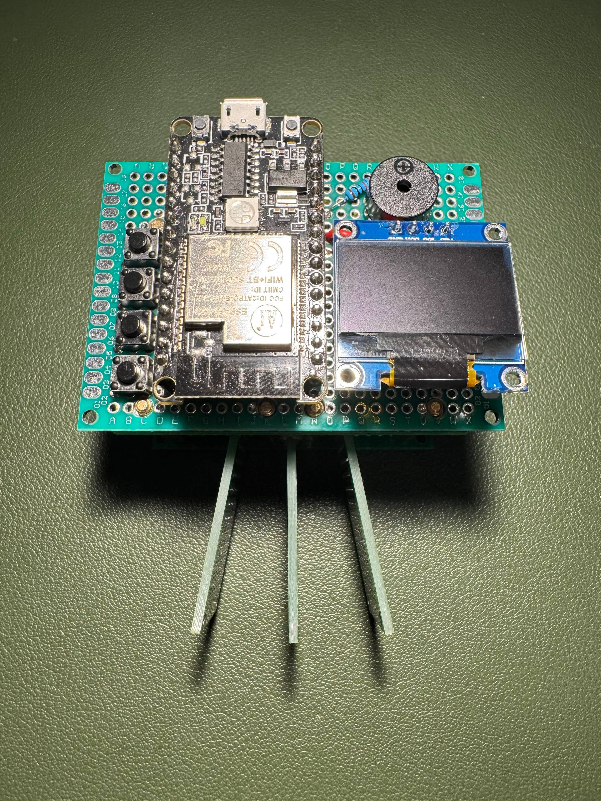

# DIY ESP32 CW trainer and iambic paddle



This repository starts with a breadboard CW keyer/trainer and a handmade dual
paddle. The first firmware milestone generates correctly timed dits and dahs;
decoding, training modes, menus, and non-blocking iambic A/B logic come next.

## Assumed prototype hardware

- Waveshare ESP-C3-32S-Kit (ESP32-C3, onboard CH340 USB-to-UART)
- 0.96-inch 128x64 SSD1306 I2C OLED, normally address `0x3C`
- Passive piezo buzzer (not an active fixed-tone buzzer)
- Two normally-open lever microswitches, such as Omron D2F/D2FC style
- Two paddles, a rigid base, pivots, return magnets or springs, and adjustment screws
- Breadboard, jumpers, and USB power

Check the exact ESP32 and OLED markings before applying power. The OLED must be
3.3 V compatible. Do not connect an unknown 5 V I2C module directly to ESP32 pins.

## Breadboard wiring

All grounds must be common.

| Part | Terminal | ESP32 |
|---|---|---|
| OLED | VCC | 3V3 |
| OLED | GND | GND |
| OLED | SDA | GPIO 6 |
| OLED | SCL | GPIO 7 |
| Dit switch | COM | GND |
| Dit switch | NO | GPIO 9 |
| Dah switch | COM | GND |
| Dah switch | NO | GPIO 10 |
| Passive piezo | + | GPIO 0 through 100 ohm-1 kOhm resistor |
| Passive piezo | - | GND |

The paddle inputs use the ESP32's internal pull-ups, so an open switch reads
HIGH and a pressed switch reads LOW. GPIO 10 is not a strapping pin, but GPIO 9
is: do not hold the DIT paddle while resetting or powering on. The board's
user/BOOT button will also act like DIT. GPIO 0 is used for the passive piezo so
the sidetone does not illuminate the extremely bright onboard RGB LED on GPIO 4.

GPIO 2, 8, and 9 are ESP32-C3 strapping pins. GPIO 9 is used here at the user's
request and is also associated with the board's user/download-button circuitry.
Avoid GPIO 18/19 (native USB) and GPIO 20/21 (the onboard CH340 serial path).
GPIO 0 is suitable as a driven buzzer output even though it produced false LOW
readings when previously tested as a bare paddle input.

One channel of the onboard RGB LED on GPIO 4 follows the keyed sidetone using
low-duty PWM. Its brightness is set by `STATUS_LED_DUTY` in `include/config.h`:
`0` is off and `255` is maximum. The default `13` is about five percent.

For a small piezo disc, direct GPIO drive through a series resistor is suitable
for the prototype. A magnetic/electromagnetic buzzer can draw too much current:
drive it with an NPN transistor or logic-level MOSFET and add a flyback diode if
the device is inductive. Never drive a speaker directly from the GPIO.

## Paddle mechanical design

Build the key as two independent levers mirrored around a 10-14 mm finger gap.
A reliable first version is easier with each lever pivoting on an M3 shoulder
screw or an M3 screw passing through a small ball bearing. A plain screw clamped
through FR4 tends to bind and gives inconsistent return force.

Suggested starting dimensions:

- base: about 90 x 60 mm, heavy or clamped to the desk
- lever: 70-90 mm long, 10-15 mm wide, 1.6-2.0 mm FR4
- pivot-to-finger-pad distance: 50-65 mm
- pivot-to-switch-contact distance: 12-20 mm
- finger pads: 25-35 mm tall with rounded edges
- movement at finger pad: adjustable around 0.5-1.0 mm
- switch pre-travel: leave a small clearance; do not hold the plunger depressed

FR4 is the forgiving prototype material: stiff, easy to drill, electrically
insulating, and inexpensive. Wet-sand cut edges and avoid breathing fiberglass
dust. Carbon fiber is conductive and its dust is hazardous; if used, isolate it
from all electrical contacts and machine it with proper extraction and PPE.

### One lever, from the side

```text
 finger force ->
       [pad]=================[pivot]---[adjust screw]
                                  |          |
                            return spring  switch lever
                                               [COM/NO]
```

Mount each microswitch rigidly with its lever facing the paddle's adjustment
screw. Put an M3 nylon-tipped screw and locknut in the paddle or a fixed bracket;
use it to set contact spacing. Add a second stop screw so the microswitch itself
does not absorb excessive finger force.

### Return force options

Use one method per paddle:

1. **Opposing magnets (preferred):** one small magnet on the lever and one on an
   adjustable fixed bracket, like poles facing. This is smooth and has no rubbing.
2. **Extension spring:** connect a light spring close to the pivot and provide
   several anchor holes. Moving the anchor changes force. Ensure it cannot pull
   the lever sideways.
3. **Torsion spring:** place it concentrically on the pivot. Compact, but the
   pivot geometry and spring selection are less forgiving.

The microswitch's own spring can return a very light lever, but relying on it
usually produces uneven left/right feel. Set the independent return mechanism
first, then adjust the screw until the switch actuates just before the hard stop.

### Contact wiring and strain relief

Use `COM` and `NO`, not `NC`. Confirm the terminals with a continuity meter;
markings differ between switch families. Twist each signal wire with a ground
wire, route both pairs away from the buzzer leads, and secure the cable to the
base so movement never reaches a solder lug. A future detachable key can use a
3.5 mm TRS jack: tip=dit, ring=dah, sleeve=ground (make this convention explicit
on the enclosure).

## Build and upload

This project uses PlatformIO:

```sh
pio run
pio run --target upload
pio device monitor
```

If dit and dah are reversed, swap GPIO 9/10 in `include/config.h` rather than
rewiring the key. At startup the OLED should show `READY`; holding a paddle emits
repeated elements at 18 WPM. Squeezing both alternates dit and dah in this first,
deliberately simple prototype.

## Bring-up checklist

1. With power disconnected, continuity-test each paddle from its GPIO wire to ground.
2. Power only the ESP32 and verify serial output.
3. Add the OLED and confirm its voltage, pin order, address, and `READY` screen.
4. Add the piezo and briefly test the sidetone.
5. Connect one switch at a time; verify dit, dah, then squeeze behavior.
6. Adjust both paddles for equal force and travel only after electrical testing.

## Planned firmware milestones

- Non-blocking keyer with debouncing and element memory
- Selectable iambic mode A/B and paddle reversal
- Morse character decoder with adaptive letter/word gaps
- WPM and tone controls stored in nonvolatile settings
- Koch/Farnsworth trainer, random groups, callsigns, and score history
- Optional headphone/audio driver and rechargeable enclosure version
